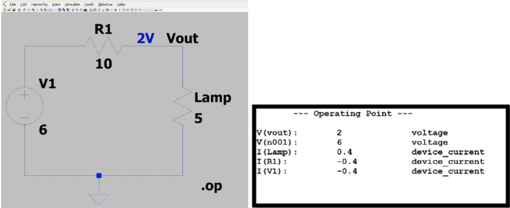

# LTSpice Lab 1 by Neil Johari

## Learning Objectives

1. You will be able to analyze a basic circuit (one without energy storage elements
   or dependent sources) by hand using Kirchoff's Laws and Nodal Analysis
2. You will be able to construct basic circuits using LTSpice software
3. You will be able to analyze the result of LTSpice of simulations

## Learning Assessments

- What is Ohm's Law?
- What are Kirchoff's Voltage Law and Kirchoff's Current Law?
- Do Kirchoff's laws apply to non-ohmic devices?
- Give a brief description of what nodal analysis is
- What are the main steps to performing nodal analysis?
- How does the SPICE engine programmatically analyze circuits?
- What is a ballast resistor?
- What SPICE directive do we use to perform a DC operating point simulation?
- Simulate a basic battery, lamp, and resistor in series using LTSpice, and
   retrieve the operating point analysis results.
- Why is SPICE useful in analyzing circuits with elements like diodes?

## Lab Assignment
Estimated completion time: ~1.5 hours +- 30 minutes. The variation depends
heavily on skill level coming in, and the majority of time is expected to be
reading the material in this lab and grasping concepts.

Please contact an IA if you are having difficulties and are spending more time than this!

**I care more about you trying the problems and providing deliverables (the
LTSpice screenshots proving you played with the software) than the fact that
your answers are correct. This is a lot of work and you're not expected to do
everything correctly!!**

1. You will solve a basic problem set of circuit analysis by hand. These
   problems are designed to be simple and do not have any "tricks" (30-45
minutes).
2. You will simulate two circuits: a basic circuit with only devices which
   follow Ohm's law, and another circuit with a non-linear device. You will then
analyze this circuit and discuss the results. (30-60 minutes).
3. You will set up a call with an IA to discuss your work in this lab (5-10
   minute call which may involve answering some basic conceptual questions, and
going over your submission).

## Content
### Introduction

In lab, you have explored some basic concepts like voltage and current.
Additionally, you have built a voltage divider and explored some interesting
circuits.

The goal of this lab is to allow you to explore these concepts further to expose you to some of the basics of Electrical Engineering.

Many of the concepts we cover here are a preview of what you might learn in a
course like EECS 215. If you enjoy this lab and the concepts of it, please
consider taking the course!

If you find these concepts easy, consider completing the advanced version of
this lab written by Sarah. Many of you asked about our liberal usage of
capacitors in the circuits you've designed, particularly around LDOs. In that
lab, you will design filters using capacitors and explore basic first order
circuits; hopefully, this gives some intuition around how we can exploit energy
storage elements to stabilize our circuits.

### Credits

All tables and examples are from the EECS 215 course and book. Much of the
wording is almost verbatim from the book, though topics were hand picked and
distilled to prepare you for this lab. In particular, the course uses "Circuit Analysis and Design" by Fawwaz T Ulaby, Michael M. Maharbiz, and Cynthia M. Furse.

The assignments are taken directly from Lab 1 of the course, which means that if
you choose to take the course, you're already (very slightly) ahead! After this
lab you'll have played with LTSpice, which most students entering the course
haven't... this will make all the labs significantly easier to work with.

This book can be freely downloaded [here](http://cad.eecs.umich.edu/). It is not
required to complete this lab or understand all the material, but may serve as a
helpful reference if you need a more detailed primer than we provide here.

### Disclaimer

This lab glosses over topics I believe were not relevant to being able to
complete the end goal of simulation with SPICE. A partial list of some topics
that this manual hand-waves over is below, and hopefully if you enjoyed this lab
you will go on to explore these in more depth in future classes:
- Dependent voltage and current sources
- Source transforms
- Wye-Delta transforms
- Resistance and conductance at a material level
- Power
- Mesh analysis
- Supernodes

### Pre-requisites

I assume you are familiar with the concepts of charge, current, and voltage. If
you are not, please read the "Circuits Primer" on Canvas under `Files > Labs >
Introductory Documents > Circuits_Primer.pdf`. This is an excellent way to
intuitively grasp voltage and how it relates to current.

### Circuit Basics
#### Terminology
Here are some reference tables that will be useful in understanding circuit
diagrams. Table 1-1 covers units you might encounter and their symbols, Table
1-2 covers SI units, and Table 1-3 shows common circuit elements.

Some important terms we will formalize:

- Node: An electrical connection point that connects multiple circuit elements
  * Note that we often draw things in a way that's easy to visualize, but really
    anything connected by the same wire with no circuit elements in between is
    _part of the same node_.
- Branch: Trace between two consecutive nodes with only one element in between
  them
- Loop: Closed path with the same start and end node
- Mesh: A restricted kind of loop: it is a loop that encloses no other loops
- In series: elements that share the same current
- In parallel: elements that share the same voltage

#### Reference nodes

One thing many of you struggled with during labs was understanding the
importance of ground.

The big idea is that voltage is by definition *between two points*. However, for
convenience sometimes we like to assign a particular node to be our _ground_
node, so that we can measure all our voltages relative to this.

Say we have a circuit and we are measuring the voltage between two nodes, a and
b. Then `V_ab = V_a - V_b`. Now let's say that we make all future measurements
relative to node b... let us assign node b to be our reference point by calling
it ground. Now we are allowed to simply refer to `V_a` and it is implied that it
is relative to ground (node b).

#### The resistor

A resistor is a device which impedes current. A resistor is an excellent example
of an almost perfect "Ohmic" device. An ohmic device is one which follows Ohm's
Law, `V = IR`, at least for some particular range of current (called the linear
region).

Not all devices follow this relationship! Elements like diodes are nonlinear and
we cannot use Ohm's law for these.

#### Passive Sign Convention

There are two ways to assign polarity to an element with current entering it.

We will choose to assign current entering a device to be defined as entering the
(+) side of v. We will not cover power in this lab, but this effectively means
that any circuit elements dissipating power will have a `P > 0`, and any
elements supplying power will have a `P < 0`.

### Circuit Analysis Fundamentals

All circuit theory is built on a pretty small set of fundamental laws, of which
KCL and KVL are the most important.

The most interesting thing is that these laws are ALWAYS true; they are built
upon fundamental laws of conservation of energy. This means that even if you
have a non-ohmic device, you absolutely can still write these equations and they
will hold.

#### Kirchoff's Current Law (KCL)

In an ideal circuit, a node is unable to store, generate, or dissipate electric
charge. Thus, all current entering a node must equal all current leaving a node.

In other words, the sum of all currents entering a node must equal 0.

Here is a [good video on
KCL](https://www.khanacademy.org/science/electrical-engineering/ee-circuit-analysis-topic/ee-dc-circuit-analysis/v/ee-kirchhoffs-current-law).

#### Kirchoff's Voltage Law (KVL)

The law of conservation of energy states that if electric charge is moved around
a closed loop (where end position = start position), then the net gain or loss
of energy must be 0.

Voltage is related to potential energy, thus the algebraic sum of voltages
around a closed loop must be 0.

In terms of getting the signs right, follow these two rules and you'll get the
right equation every time:
1. Go around your loop in a clockwise fashion
2. Assign a positive sign to your KVL equation if you encounter the (+) side of
   an element first, and a negative sign if you encounter the (-) side first

If you would like a video on KVL, [here is our
recommendation](https://www.khanacademy.org/science/electrical-engineering/ee-circuit-analysis-topic/ee-dc-circuit-analysis/v/ee-kirchhoffs-voltage-law).

Here is [a
video](https://www.khanacademy.org/science/electrical-engineering/ee-circuit-analysis-topic/ee-dc-circuit-analysis/v/ee-labeling-voltages)
showing an example of how we label voltages.

#### Nodal Analysis

Using KVL and KCL can get you far, but it would be nice to have a codified set
of steps to solve for all voltages and currents in a circuit.

If you have taken physics in high school or Physics 240, you know that it can be
frustrating to throw KVL/KCL mindlessly at a circuit and hope to get a set of
linearly independent equations to solve the circuit problem at hand.

The goal of the method we present is a way to mindlessly solve a circuit. 

Steps for Nodal Analysis:
1. Identify all nodes in the circuit
2. Choose a ground node
3. Generate a KCL equation for each non-reference node. An easy way to make this mindless is
   to always form the sum of currents leaving the node (assigning a negative
sign to any current entering the node).
4. Generate a KVL expression for each voltage source representing the drop between 2 nodes connected  by the voltage source
5. Solve the independent simultaneous equations using a solver program like
   MATLAB.

Please watch [this
video](https://www.khanacademy.org/science/electrical-engineering/ee-circuit-analysis-topic/ee-dc-circuit-analysis/v/ee-node-voltage-method-steps-1-to-4) for a good overview of the process. The video
uses a slightly different set of steps that perform the same tasks.

#### Application of Fundamental Laws 1
Using KVL, KCL, and Ohm's Law, solve for v1, v2, v3, i1,  i2, and i3 in the circuit
below. Do not directly apply Nodal Analysis (though many elements of your
calculation would wind up similar).

#### Application of Fundamental Laws 2

Using KVL, KCL and Ohm's Law solve for all unknown currents and voltages in this
circuit. Do not directly apply Nodal Analysis (though many elements of your
calculation would wind up similar).

#### Application of Nodal Analysis

Apply nodal analysis to determine the current I in the figure below. There are
many ways to do this. If you are struggling, watch the video linked before the
assignments! You can use MATLAB to solve the equations if needed, though it
should be trivial to do by hand.

### SPICE and LTSpice

SPICE is an analog electronic circuit simulator that can help predict circuit
behavior by fully simulating it. The guts of SPICE utilize nodal analysis to
programmatically calculate all node voltages—this is why we had you learn and
apply nodal analysis. SPICE is extremely old software and we do not interface
with it directly.

LTSpice is freeware that implements the SPICE engine, and is the most popular
software for interfacing with SPICE.
The software includes a graphical interface that can be used with Windows and Mac OS X, and is available on CAEN computers. 

LTspice is available at the link below, which also includes documentation on a ‘Getting Started Guide’ and shortcuts for Mac OS X:  http://www.linear.com/designtools/software/#LTspice

Please note that the Windows and Mac interfaces are _very_ different. If you are
on Mac, it will be harder and you can make it easier for yourself by having the
Mac OS X shortcuts page open while you work.

#### Creating Your Circuit
You should begin by creating a new schematic (New -> Schematic). Then you add
your components and wire them together.

- Add new components. Use the `voltage` and `res` components for this lab.
  * Windows: Edit->Component
  * Mac: Draft->Component
- Add a reference ground node
  * Windows: Press ground from the menu bar. 
  * Mac: Draft->Net Name, select GND (global node 0) and place.
- Connect components with wires.
  * Windows: Edit->Draw Wire
  * Mac: Draft->Wires
- Define component values by right clicking on each component and changing the
  value.

#### Running a Simulation

LTSpice can perform lots of different kinds of simulations, specified by a
"SPICE Directive". The simulation mode you will use in this lab is called the
"DC operating point". 

Windows: Simulate -> Edit Simulation Command. Then choose `DC op pnt`, click OK,
and place the text anywhere on the schematic.

Mac: Draft->SPICE Directive, type `.op`, and place the text anywhere in the
schematic.

Now press `Run` (the running person icon).

#### LTSpice Assignment 1:
Simulate the following circuit: 

Obtain the following screenshots for your submission for this lab:

#### LTSpice Assignment 2:

From our DC op point simulation, we see that 0.4 A pass through our lamp. Let's
suppose that the manufacturer recommends we should only give 0.3 A max to our
lamp, otherwise it will explode...

In order to make our circuit safe while still operating at 6V, we should play
with our resistor's resistance to impede current until we are at 0.3 A. A
resistor used to reduce current or voltage in a circuit is called a *ballast
resistor*.

SPICE is a powerful tool that can help us do this pragmatically by sweeping different resistor values. To do this, perform the following steps:

- Change the resistance value to the text `{ballast}` (this makes the resistance
  a variable called ballast).
- Define a new SPICE directive `.step param ballast 5 20 0.5`. This will sweep
  through different values for `ballast`.
  * The format for this command is `.step param variable start end stepsize`.
- Run the simulation and in your waveform window add a trace for `I(Lamp)`. This
  will give you `I(Lamp)` vs `R1`.

Take a screenshot of your modified circuit and the waveform window you
obtained for submission. Additionally, submit your answer to this question: What resistance value limits the current to .3 Amps? (Hint: You can double check your answer with Ohm's law, since our lamp is a linear resistor!).

#### LTSpice Assignment 3:

The lamp circuit is something we could've done by hand with almost no issue.
This is because the lamp had a linear i-v characteristic (it obeyed Ohm's law).
Not all devices are ohmic, however... 

The most accessible example of a non-linear device that you have already in fact
used in previous labs is the LED. LED stands for "light emitting diode", and
diodes are typically non-linear devices.

Here is an example of a non-linear circuit:

- For this assignment, draw the circuit above using the LED component. There are
many LEDs, but for this task right-click the LED and choose `Pick New Diode` and
select `LXHL-BW02`.
- Define the resistance value R as 0.1 Ohms.
- Similar to how we sweeped in the lamp circuit, use a SPICE directive `.dc v1 0
  4 0.01` to sweep the voltage source `v1` from 0V to 4V in steps of 0.01V.
- Plot the I(Led) in the waveform window, and change the scale of the current
  axis to values between 0-0.5A.

Things to note: we intentionally used a very small resistance. You should see
that the current rises exponentially as we increase `V1` during our sweep.

This is why we need to be careful when trying to light up an LED. A poor choice
of resistor (or the worst offense: no resistor) will easily burn out your LED or
voltage source. Ballast resistors help protect against this.

Take a screenshot of your waveform window for submission.

### What to submit for this lab
1. Your solution to "Application of Fundamental Laws 1"
  * Include all equations and any diagrams you drew to solve this problem (if
    any)
2. Your solution to "Application of Fundamental Laws 2"
  * Include all equations and any diagrams you drew to solve this problem (if
    any)
3. Your solution to "Application of Nodal Analysis"
  * Include all equations and any diagrams you drew to solve this problem (if
    any)
4. Your solution to "LTSpice Assignment 1"
  * Include both screenshots (the schematic and operating point results)
5. Your solution to "LTSpice Assignment 2"
  * Include both screenshots (the modified schematic and waveform window)
  * Include your answer to the question "What resistance value limits the
    current to 0.3 Amps"
6. Your solution to "LTSpice Assignment 3"
  * Include the screenshot of your waveform window

### Appendix
#### Solving simultaneous systems of equations

[Here is a video by Professor Fred Terry on "Essential Linear Algebra I: Solving
Linear Equations Using Matrix
Methods"](https://web.eecs.umich.edu/~fredty/EECS215FA15/Essential%20Linear%20Algebra%20I/Essential%20Linear%20Algebra%20I.html).
In it, he describes the process of solving these systems using MATLAB in
particular. Here is a [download for the MATLAB file he
used](https://umich.instructure.com/courses/367878/files/13124151/download?wrap=1).

I personally like using the Symbolic Math Toolbox in MATLAB, which lets you
define symbols and equations much like you would on a CAS calculator. If you're
interested, [here is the MATLAB documentation on using the `solve`
function](https://www.mathworks.com/help/symbolic/solve-a-system-of-linear-equations.html).

