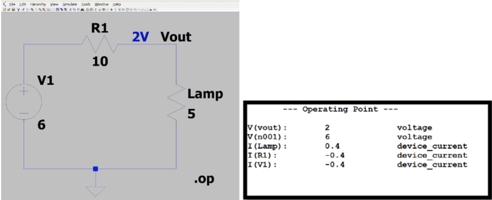

# LTSpice Lab 2 by Neil Johari

## Learning Objectives

1. You will be able to construct basic circuits using LTSpice software
2. You will be able to analyze the result of LTSpice of simulations

## Learning Assessments

- How does the SPICE engine programmatically analyze circuits?
- What is a ballast resistor?
- What SPICE directive do we use to perform a DC operating point simulation?
- Simulate a basic battery, lamp, and resistor in series using LTSpice, and
   retrieve the operating point analysis results.
- Why is SPICE useful in analyzing circuits with elements like diodes?

## Lab Assignment
Estimated completion time: ~0.5 hours +- 30 minutes. The variation depends
heavily on skill level coming in, and the majority of time is expected to be
reading the material in this lab and grasping concepts.

Please contact an IA if you are having difficulties and are spending more time than this!

**I care more about you trying the problems and providing deliverables (the
LTSpice screenshots proving you played with the software) than the fact that
your answers are correct. This is a lot of work and you're not expected to do
everything correctly!!**

1. You will simulate two circuits: a basic circuit with only devices which
   follow Ohm's law, and another circuit with a non-linear device. You will then
analyze this circuit and discuss the results. (30-60 minutes).
2. You will set up a call with an IA to discuss your work in this lab (5-10
   minute call which may involve answering some basic conceptual questions, and
going over your submission).

## Content
### Introduction

The goal of this lab is to allow you to explore these concepts further to expose you to some of the basics of Electrical Engineering.

In lab 1, we covered some concepts surrounding basic circuit analysis. In this
lab, you will use LTSpice to simulate circuits.

Many of the concepts we cover here are a preview of what you might learn in a
course like EECS 215. If you enjoy this lab and the concepts of it, please
consider taking the course!

If you find these concepts easy, consider completing the advanced version of
this lab written by Sarah. In that lab, you get to explore basic first order
circuits.

### Credits

All tables and examples are from the EECS 215 course and book. Much of the
wording is almost verbatim from the book, though topics were hand picked and
distilled to prepare you for this lab. In particular, the course uses "Circuit Analysis and Design" by Fawwaz T Ulaby, Michael M. Maharbiz, and Cynthia M. Furse.

The assignments are taken directly from Lab 1 of the course, which means that if
you choose to take the course, you're already (very slightly) ahead! After this
lab you'll have played with LTSpice, which most students entering the course
haven't... this will make all the labs significantly easier to work with.

This book can be freely downloaded [here](http://cad.eecs.umich.edu/). It is not
required to complete this lab or understand all the material, but may serve as a
helpful reference if you need a more detailed primer than we provide here.

### Pre-requisites

I assume you are familiar with the concepts of charge, current, and voltage. If
you are not, please read the "Circuits Primer" on Canvas under `Files > Labs >
Introductory Documents > Circuits_Primer.pdf`. This is an excellent way to
intuitively grasp voltage and how it relates to current.

Additionally, I assume you're familiar with basic circuit analysis. Refer to lab
one if you aren't familiar with circuit basics and nodal analysis.

### SPICE and LTSpice

SPICE is an analog electronic circuit simulator that can help predict circuit
behavior by fully simulating it. The guts of SPICE utilize nodal analysis to
programmatically calculate all node voltages—this is why we had you learn and
apply nodal analysis. SPICE is extremely old software and we do not interface
with it directly.

LTSpice is freeware that implements the SPICE engine, and is the most popular
software for interfacing with SPICE.
The software includes a graphical interface that can be used with Windows and Mac OS X, and is available on CAEN computers. 

LTspice is available at the link below, which also includes documentation on a ‘Getting Started Guide’ and shortcuts for Mac OS X:  http://www.linear.com/designtools/software/#LTspice

Please note that the Windows and Mac interfaces are _very_ different. If you are
on Mac, it will be harder and you can make it easier for yourself by having the
Mac OS X shortcuts page open while you work.

#### Creating Your Circuit
You should begin by creating a new schematic (New -> Schematic). Then you add
your components and wire them together.

- Add new components. Use the `voltage` and `res` components for this lab.
  * Windows: Edit->Component
  * Mac: Draft->Component
- Add a reference ground node
  * Windows: Press ground from the menu bar. 
  * Mac: Draft->Net Name, select GND (global node 0) and place.
- Connect components with wires.
  * Windows: Edit->Draw Wire
  * Mac: Draft->Wires
- Define component values by right clicking on each component and changing the
  value.

#### Running a Simulation

LTSpice can perform lots of different kinds of simulations, specified by a
"SPICE Directive". The simulation mode you will use in this lab is called the
"DC operating point". 

Windows: Simulate -> Edit Simulation Command. Then choose `DC op pnt`, click OK,
and place the text anywhere on the schematic.

Mac: Draft->SPICE Directive, type `.op`, and place the text anywhere in the
schematic.

Now press `Run` (the running person icon).

#### LTSpice Assignment 1:
Simulate the following circuit: 

Obtain the following screenshots for your submission for this lab:

#### LTSpice Assignment 2:

From our DC op point simulation, we see that 0.4 A pass through our lamp. Let's
suppose that the manufacturer recommends we should only give 0.3 A max to our
lamp, otherwise it will explode...

In order to make our circuit safe while still operating at 6V, we should play
with our resistor's resistance to impede current until we are at 0.3 A. A
resistor used to reduce current or voltage in a circuit is called a *ballast
resistor*.

SPICE is a powerful tool that can help us do this pragmatically by sweeping different resistor values. To do this, perform the following steps:

- Change the resistance value to the text `{ballast}` (this makes the resistance
  a variable called ballast).
- Define a new SPICE directive `.step param ballast 5 20 0.5`. This will sweep
  through different values for `ballast`.
  * The format for this command is `.step param variable start end stepsize`.
- Run the simulation and in your waveform window add a trace for `I(Lamp)`. This
  will give you `I(Lamp)` vs `R1`.

Take a screenshot of your modified circuit and the waveform window you
obtained for submission. Additionally, submit your answer to this question: What resistance value limits the current to .3 Amps? (Hint: You can double check your answer with Ohm's law, since our lamp is a linear resistor!).

#### LTSpice Assignment 3:

The lamp circuit is something we could've done by hand with almost no issue.
This is because the lamp had a linear i-v characteristic (it obeyed Ohm's law).
Not all devices are ohmic, however... 

The most accessible example of a non-linear device that you have already in fact
used in previous labs is the LED. LED stands for "light emitting diode", and
diodes are typically non-linear devices.

Here is an example of a non-linear circuit:

- For this assignment, draw the circuit above using the LED component. There are
many LEDs, but for this task right-click the LED and choose `Pick New Diode` and
select `LXHL-BW02`.
- Define the resistance value R as 0.1 Ohms.
- Similar to how we sweeped in the lamp circuit, use a SPICE directive `.dc v1 0
  4 0.01` to sweep the voltage source `v1` from 0V to 4V in steps of 0.01V.
- Plot the I(Led) in the waveform window, and change the scale of the current
  axis to values between 0-0.5A.

Things to note: we intentionally used a very small resistance. You should see
that the current rises exponentially as we increase `V1` during our sweep.

This is why we need to be careful when trying to light up an LED. A poor choice
of resistor (or the worst offense: no resistor) will easily burn out your LED or
voltage source. Ballast resistors help protect against this.

Take a screenshot of your waveform window for submission.

### What to submit for this lab
1. Your solution to "LTSpice Assignment 1"
  * Include both screenshots (the schematic and operating point results)
2. Your solution to "LTSpice Assignment 2"
  * Include both screenshots (the modified schematic and waveform window)
  * Include your answer to the question "What resistance value limits the
    current to 0.3 Amps"
3. Your solution to "LTSpice Assignment 3"
  * Include the screenshot of your waveform window

